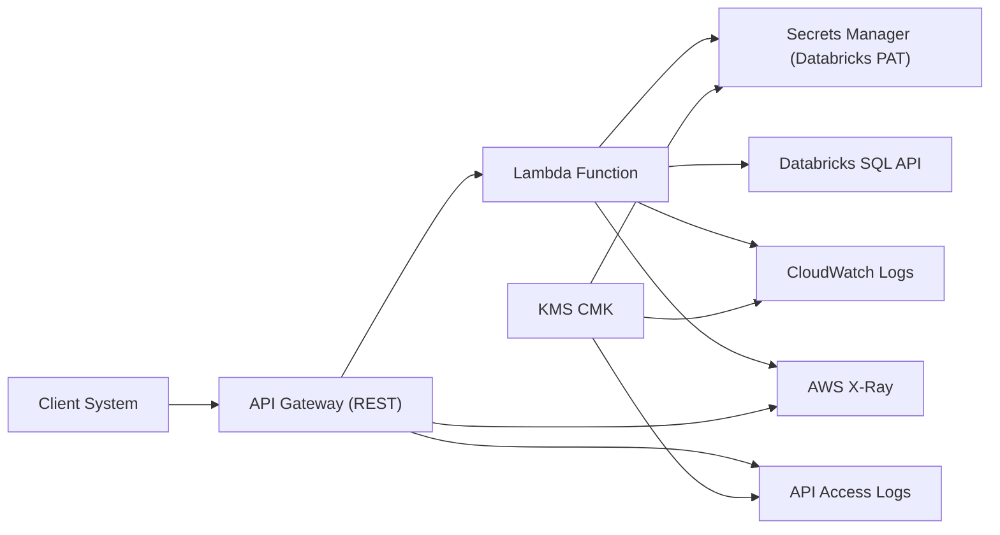
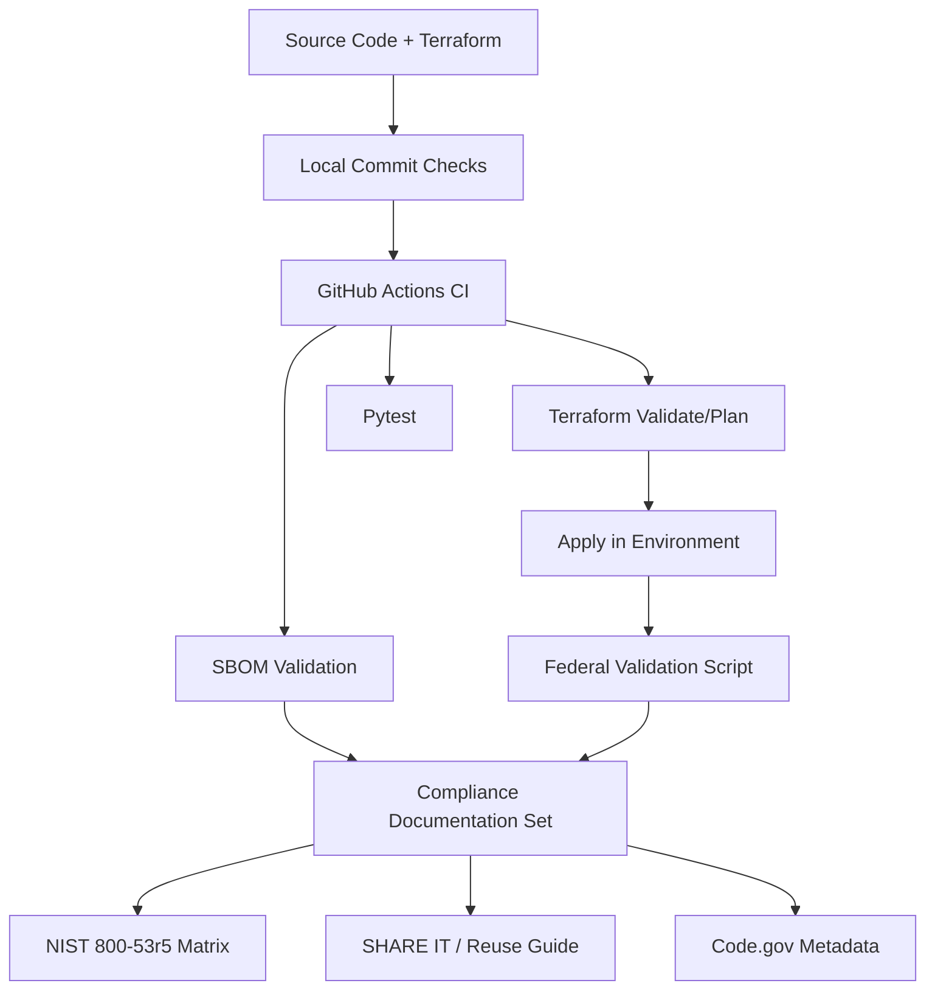

# AWS Lambda REST API -> Databricks (Federal Reusable Baseline)

This repository provisions an AWS API Gateway REST API backed by an AWS Lambda function that queries an AWS-hosted Databricks SQL Warehouse.

It is structured for federal reuse with an Infrastructure-as-Code baseline that aligns with NIST SP 800-53 Rev. 5 control implementation and post-deployment validation.

## Architecture Diagram



## What this baseline includes

- Modular Terraform (`modules/lambda_databricks_api`)
- Environment roots (`envs/dev`, `envs/prod`)
- Lambda application code and tests
- Federal-focused security defaults:
  - Customer-managed KMS encryption (Lambda env vars, Secrets Manager secret, CloudWatch log groups)
  - KMS key rotation enabled
  - CloudWatch log retention defaults at 365 days
  - API Gateway access logging + execution logging + metrics
  - X-Ray tracing for Lambda and API Gateway
  - Required resource tag schema
  - Federal mode that blocks wildcard CORS origins
  - Optional continuous compliance services:
    - AWS Config recorder + delivery channel
    - AWS Security Hub + AWS Foundational Security Best Practices standard
- Compliance artifacts:
  - NIST 800-53r5 control mapping document
  - Post-deployment validation script with evidence bundle output
  - CycloneDX SBOM and CISA 2025 minimum-element mapping
  - SHARE IT Act + Code.gov reuse alignment guide and metadata templates

## Repository layout

```text
.
├── compliance/
│   ├── NIST-800-53r5-control-matrix.md
│   ├── codegov/
│   │   ├── CODEGOV-SUBMISSION-CHECKLIST.md
│   │   └── code.json.template
│   ├── reuse/
│   │   └── SHARE-IT-CODEGOV-ALIGNMENT.md
│   ├── sbom/
│   │   ├── SBOM-MINIMUM-ELEMENTS-MAPPING.md
│   │   ├── sbom.cyclonedx.json
│   │   └── validate_sbom.py
│   └── validation/
│       └── validate_federal_baseline.sh
├── envs/
│   ├── dev/
│   └── prod/
└── modules/
    ├── federal_compliance_services/
    └── lambda_databricks_api/
```

## Deploy

1. Configure AWS credentials.
2. Configure environment values in `envs/<env>/terraform.tfvars`.
3. Deploy:

```bash
cd envs/dev
terraform init
terraform plan
terraform apply
```

## Post-deployment compliance validation

Run validation from the environment directory:

```bash
cd envs/dev
../../compliance/validation/validate_federal_baseline.sh
```

This script:
- reads Terraform outputs for deployed resource IDs
- queries AWS APIs for effective security configuration
- evaluates required baseline checks
- writes machine-readable evidence to `compliance/validation/evidence/<timestamp>/`
- exits non-zero if required checks fail

## CI/CD compliance validation

The workflow at `/Users/caseycook/Desktop/Work Source Code/databricks-lambda-restapi-terraform/.github/workflows/terraform.yml` now:
- runs Terraform plan on PRs
- runs Terraform apply on `main`
- runs post-apply federal validation on `main`
- uploads compliance evidence artifacts from `compliance/validation/evidence/`

## Local commit-time test configuration

To run the same checks as GitHub Actions on every commit:

1. Configure local env file:

```bash
cp /Users/caseycook/Desktop/Work Source Code/databricks-lambda-restapi-terraform/.env.local.test.example /Users/caseycook/Desktop/Work Source Code/databricks-lambda-restapi-terraform/.env.local.test
```

2. Install commit hook:

```bash
/Users/caseycook/Desktop/Work Source Code/databricks-lambda-restapi-terraform/scripts/setup-commit-hooks.sh
```

3. Optional: load env vars into current shell:

```bash
source /Users/caseycook/Desktop/Work Source Code/databricks-lambda-restapi-terraform/scripts/load-local-test-env.sh
```

Commit hook behavior:
- Runs `/Users/caseycook/Desktop/Work Source Code/databricks-lambda-restapi-terraform/scripts/run-ci-local.sh`
- Validates SBOM minimum elements
- Validates Code.gov metadata minimum elements
- Runs Terraform `fmt`, `init -backend=false`, and `validate` for `modules`, `envs/dev`, and `envs/prod`
- Installs Python test dependencies and runs `pytest`

To run the Terraform deployment-workflow parity checks locally (requires AWS credentials):

```bash
TF_ENV=dev /Users/caseycook/Desktop/Work Source Code/databricks-lambda-restapi-terraform/scripts/run-terraform-workflow-local.sh
```

## NIST 800-53 Rev. 5 mapping

Control mapping is documented in:
- `compliance/NIST-800-53r5-control-matrix.md`

This includes implemented controls, evidence commands, and shared-responsibility notes for agency tailoring.

## Documentation and Reuse Diagram



## SBOM (CISA 2025 minimum-elements aligned)

- SBOM file: `/Users/caseycook/Desktop/Work Source Code/databricks-lambda-restapi-terraform/compliance/sbom/sbom.cyclonedx.json`
- Mapping and governance: `/Users/caseycook/Desktop/Work Source Code/databricks-lambda-restapi-terraform/compliance/sbom/SBOM-MINIMUM-ELEMENTS-MAPPING.md`
- Validation command:

```bash
python3 compliance/sbom/validate_sbom.py
```

## SHARE IT Act and Code.gov Alignment

- Reuse guide: `/Users/caseycook/Desktop/Work Source Code/databricks-lambda-restapi-terraform/compliance/reuse/SHARE-IT-CODEGOV-ALIGNMENT.md`
- Code.gov template: `/Users/caseycook/Desktop/Work Source Code/databricks-lambda-restapi-terraform/compliance/codegov/code.json.template`
- USDA Code.gov metadata: `/Users/caseycook/Desktop/Work Source Code/databricks-lambda-restapi-terraform/compliance/codegov/code.json`
- Code.gov checklist: `/Users/caseycook/Desktop/Work Source Code/databricks-lambda-restapi-terraform/compliance/codegov/CODEGOV-SUBMISSION-CHECKLIST.md`
- Code.gov metadata validator: `/Users/caseycook/Desktop/Work Source Code/databricks-lambda-restapi-terraform/compliance/codegov/validate_codegov_metadata.py`

## Federal tailoring guidance

Before production use, tailor to your Authorizing Official (AO) requirements:

- Set `cors_allow_origins` to approved agency domains.
- Set `required_tag_keys` to your enterprise taxonomy.
- Provide `permissions_boundary_arn` if required by policy.
- Set `api_gateway_cloudwatch_role_arn` to an agency-managed shared role, or keep `create_api_gateway_cloudwatch_role = true`.
- Integrate with enterprise services (AWS Config, Security Hub, SIEM, IR playbooks).
- Add network boundary controls (for example: VPC endpoints, WAF, private connectivity) as required.

## Notes

- Do not commit real Databricks PAT values in `terraform.tfvars`.
- This baseline supports compliance validation evidence but does not replace agency ATO processes.
