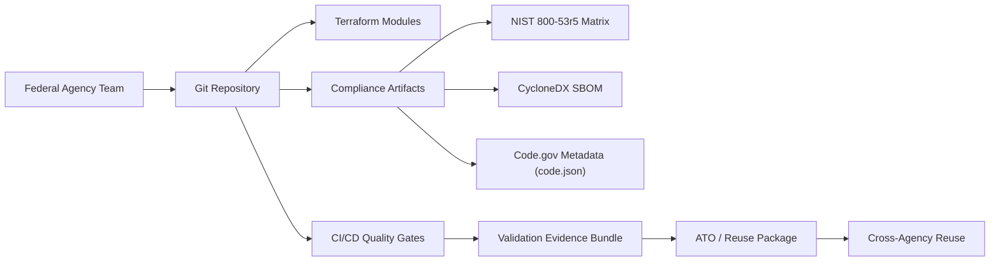
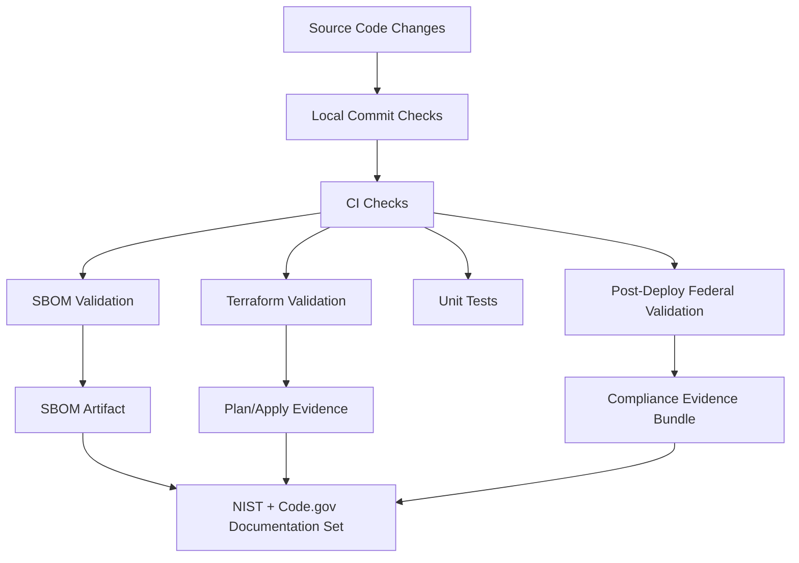

# SHARE IT Act and Code.gov Alignment Guide

This guide supports federal reuse of this repository by aligning implementation and documentation with:

- SHARE IT Act (Public Law 118-188)
- Federal Source Code Policy implementation practices (Code.gov ecosystem)

## Purpose

- Make code reusable across federal agencies.
- Provide traceable documentation for security, operations, and open-source release readiness.
- Standardize release metadata and evidence artifacts.

## Reuse Architecture

## Documentation and Evidence Flow

## SHARE IT Act Alignment (Implementation Guidance)

- Reusable codebase with environment-specific overlays (`envs/dev`, `envs/prod`) and modular components (`modules/*`).
- Documented deployment and compliance validation process to enable adoption by other agencies.
- Compliance artifacts are bundled in-repo for transferability:
  - NIST control matrix
  - SBOM and validation
  - Code.gov metadata template and checklist

## Code.gov Alignment (Implementation Guidance)

- Use `${WORK_SOURCE_CODE_ROOT}/databricks-lambda-restapi-terraform/compliance/codegov/code.json.template` as the agency metadata starting point.
- Run the checklist in `${WORK_SOURCE_CODE_ROOT}/databricks-lambda-restapi-terraform/compliance/codegov/CODEGOV-SUBMISSION-CHECKLIST.md` before submission.
- Keep metadata synchronized with releases and repository URLs.
- Integrate SBOM and compliance evidence into release governance.

## Recommended Operational Cadence

1. On every PR: run local and CI quality gates.
2. On every release: refresh SBOM and `code.json` metadata.
3. Quarterly: review NIST mapping, metadata accuracy, and reuse readiness.

## References

- [SHARE IT Act (Public Law 118-188)](https://www.congress.gov/bill/118th-congress/house-bill/9566)
- [Code.gov](https://code.gov)
- [Federal Source Code Policy (M-16-21)](https://obamawhitehouse.archives.gov/sites/default/files/omb/memoranda/2016/m_16_21.pdf)
- [CISA SBOM Minimum Elements (2025)](https://www.cisa.gov/resources-tools/resources/2025-minimum-elements-software-bill-materials-sbom)

